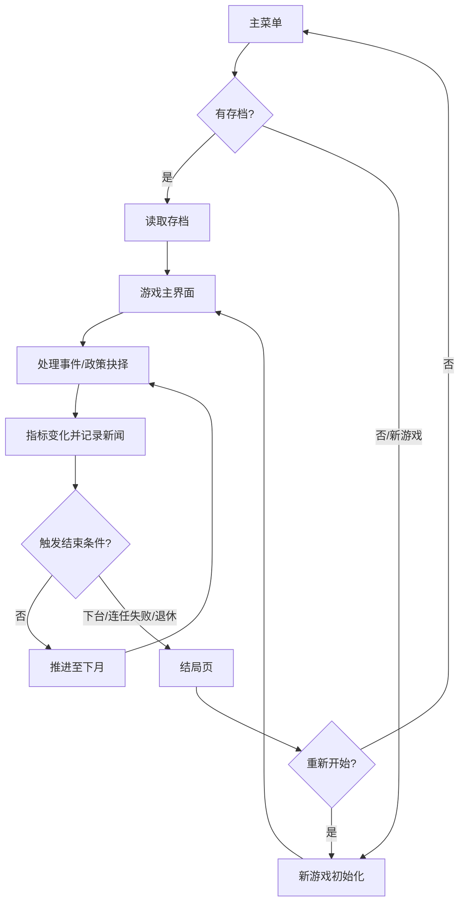

# 总理模拟器 — 产品需求文档（PRD）

## 1. 产品概述
《总理模拟器》是一款基于 Electron 的桌面端文字决策模拟游戏，玩家化身为虚构国家「埃尔瓦尼亚共和国」的总理，通过逐月决策治理国家，在民意、经济、稳定、外交等多重指标间寻求平衡，争取连任并书写属于自己的执政传奇。
- 解决的问题：为喜爱政治模拟、策略经营类游戏的玩家提供沉浸式、有深度的单机桌面体验
- 目标用户：策略/模拟类游戏爱好者、政治题材兴趣者、喜欢文字决策游戏的玩家
- 市场价值：填补国产高质量政治模拟单机游戏的空白，桌面端体验优于浏览器，可离线运行、数据本地持久化

## 2. 核心功能

### 2.1 用户角色
本游戏为单机游戏，无多用户角色区分。玩家即「总理」，拥有以下核心权限：
- 推进时间（逐月推进执政进程）
- 对随机事件与政策提案做出抉择
- 分配国家预算与资源
- 在任期届满时参与大选

### 2.2 功能模块
1. **主菜单页**：游戏标题展示、新游戏、继续游戏（读取存档）、关于说明
2. **游戏主界面（仪表盘）**：国家指标面板、当前事件/决策面板、新闻动态流、时间推进控制、任期信息
3. **结局页**：执政总结、关键事件回顾、结局评级、成就解锁、重新开始

### 2.3 页面详情
| 页面名称 | 模块名称 | 功能描述 |
|-----------|-------------|---------------------|
| 主菜单页 | 标题展示区 | 国徽样式标识、游戏名「总理模拟器」、副标题与装饰边框，营造庄重仪式感 |
| 主菜单页 | 操作入口 | 「新游戏」「继续游戏」「关于」三个核心按钮，继续游戏按钮在有存档时高亮 |
| 主菜单页 | 关于面板 | 游戏简介、玩法说明、版本信息，以弹层形式展开 |
| 游戏主界面 | 顶部状态栏 | 任期届数、当前年月、总理姓名、回合数倒计时、内阁支持度概览 |
| 游戏主界面 | 国家指标面板 | 六大核心指标（民意、国库、经济、稳定、外交、声望）的数值与趋势条 |
| 游戏主界面 | 事件决策区 | 当前需处理的事件标题、背景描述、2-4 个选项，每个选项显示预期影响提示 |
| 游戏主界面 | 新闻动态流 | 按时间倒序展示已发生事件、决策结果、社会反馈，可滚动浏览 |
| 游戏主界面 | 时间推进控制 | 「推进至下月」主按钮、自动连续推进开关、暂停提示 |
| 游戏主界面 | 内阁面板 | 内阁成员名单、各部长忠诚度与建议，可征询意见影响决策 |
| 结局页 | 执政总结 | 总执政时长、最终各项指标、任期内处理事件总数 |
| 结局页 | 结局评级 | 根据综合表现给出 S/A/B/C/D 评级与结局叙事文本 |
| 结局页 | 成就墙 | 已解锁成就列表与未解锁成就灰显，含解锁条件说明 |
| 结局页 | 操作入口 | 「重新开始」「返回主菜单」按钮 |

## 3. 核心流程

玩家从主菜单开始新游戏或读取存档进入游戏主界面。每回合（一个月）玩家需处理随机生成的事件与政策抉择，做出选择后各项国家指标随之变化，新闻流记录决策后果。当民意过低可能触发不信任投票下台，国库枯竭引发经济崩溃，任期满四年进行大选，依据综合指标决定是否连任。游戏在玩家下台、连任失败或主动退休时进入结局页，展示执政总结与评级。

## 4. 用户界面设计

### 4.1 设计风格
**美学方向：「内阁战时会议室 / 政治家办公桌」——庄重、权威、复古而精致**

- 主色调：午夜藏青（#0d1b2a）与炭灰（#1b263b）为深色基底，象征权力的深邃
- 次要色：羊皮纸米色（#f4ecd8）用于关键内容承载区，营造官方文书的质感
- 强调色：古金（#c9a961）用于标题、按钮边框、指标高亮，象征权威与尊贵
- 警示色：深红（#8b2635）用于危险指标与负面事件
- 成功色：苔藓绿（#5a7d3a）用于正向指标与良性结果
- 字体：标题使用「Cormorant Garamond」古典衬线体（庄重如国家公文），正文使用「Spectral」雅致衬线体保证可读性，数据数字使用「IBM Plex Mono」等宽体
- 按钮风格：带细金边框的矩形/微圆角按钮，悬停时金色描边加亮、轻微上浮，重要按钮带国徽式装饰
- 布局风格：仪表盘式分区布局，左侧国家指标侧栏 + 中央事件决策主区 + 右侧新闻流，顶部状态栏横贯
- 纹理细节：羊皮纸纹理叠加、暗角晕影、国徽水印、细密网格底纹、古典几何边框装饰
- 图标风格：线性古典徽章式图标，配合少量 emoji 点缀（🏛️📜⚖️ 等）增强可读性

### 4.2 页面设计概览
| 页面名称 | 模块名称 | UI 元素 |
|-----------|-------------|-------------|
| 主菜单页 | 标题展示区 | 居中大号衬线标题、国徽装饰、金色细线分隔、暗色渐变背景叠羊皮纸纹理、淡入上浮动效 |
| 主菜单页 | 操作入口 | 纵向排列金边按钮，悬停金色发光描边，继续游戏按钮存档存在时点亮 |
| 游戏主界面 | 顶部状态栏 | 横贯深色栏，左侧任期信息，中央年月与回合，右侧内阁支持度进度条 |
| 游戏主界面 | 国家指标面板 | 六张羊皮纸卡片纵向排列，每卡含图标、指标名、数值、带渐变填充的趋势条 |
| 游戏主界面 | 事件决策区 | 中央主卡片，顶部事件标题与分类标签，中部背景叙述文本，底部选项按钮列表，选项含预期影响图标提示 |
| 游戏主界面 | 新闻动态流 | 右侧窄栏，时间戳+标题+摘要的条目列表，新条目滑入动画，可滚动 |
| 游戏主界面 | 时间推进控制 | 底部居中大号金色主按钮「推进至下月」，左侧自动推进开关 |
| 结局页 | 执政总结 | 居中卡片展示任期统计，数字使用大号等宽体，配趋势小图 |
| 结局页 | 结局评级 | 巨大字母评级（S/A/B/C/D）配金色描边光效，下方结局叙事段落 |
| 结局页 | 成就墙 | 网格排列圆形徽章，已解锁金色发光，未解锁灰显锁形 |

### 4.3 响应式
- 桌面优先设计，目标窗口默认 1280×800，最小 1024×640
- 仪表盘在窄窗时侧栏可折叠，新闻流可收起为浮动按钮
- 触摸优化：按钮最小点击区域 44px，间距充足，支持触控板手势滚动

### 4.4 动效与交互
- 主菜单加载：标题逐字淡入上升、国徽旋转入场、装饰线条由中心向两端展开
- 指标变化：数值滚动计数动画，趋势条平滑填充过渡，负向变化红色闪烁
- 事件出现：卡片由下方滑入并伴随轻微缩放，选项按序错峰淡入
- 决策反馈：选定选项后其他选项淡出，选中项金色脉冲，随后新闻条目滑入新闻流
- 时间推进：顶部年月翻牌动画，指标卡短暂高亮更新
- 结局评级：评级字母由模糊到清晰放大入场，金色粒子光效环绕
