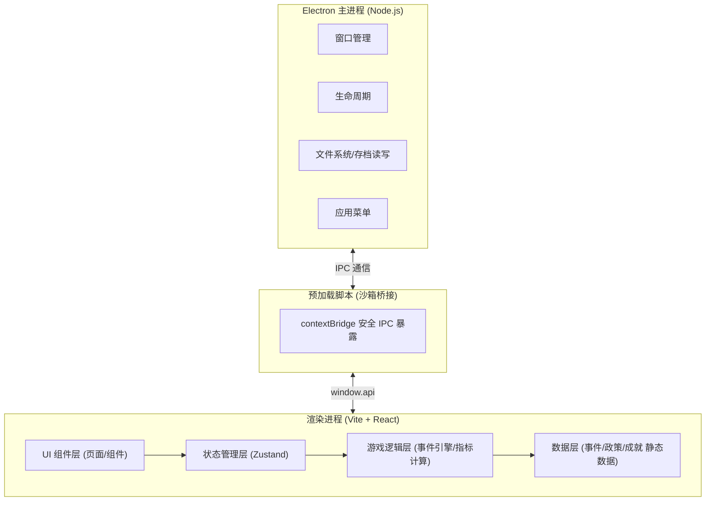
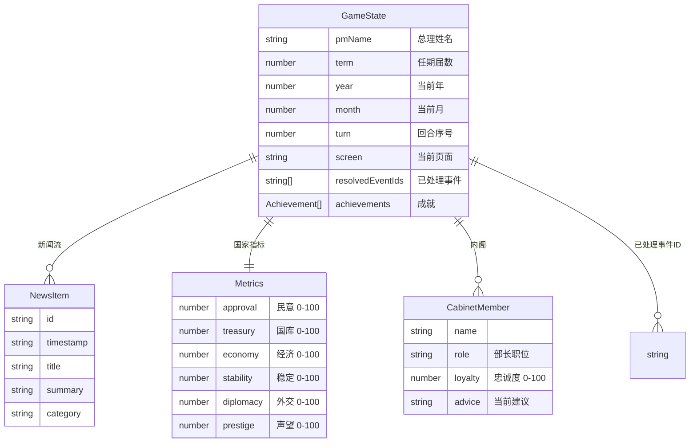

# 总理模拟器 — 技术架构文档

## 1. 架构设计

本项目采用 Electron 桌面应用架构，分离主进程与渲染进程，渲染进程内为 Vite + React 单页应用。



- 主进程：负责窗口创建、应用生命周期、本地文件读写（存档）、原生菜单
- 预加载脚本：通过 `contextBridge` 暴露受限的 `window.api`，渲染进程无法直接访问 Node API
- 渲染进程：React SPA，承载全部 UI 与游戏逻辑；通过 `window.api` 调用存档读写

## 2. 技术说明

- 桌面壳：Electron@30（主进程 + preload，contextIsolation 开启、nodeIntegration 关闭）
- 前端：React@18 + TypeScript + Vite@5
- 样式：Tailwind CSS@3 + 自定义 CSS 变量（古典 governmental 主题）
- 状态管理：Zustand（轻量，适合单机游戏状态）
- 动效：CSS 动画优先，复杂序列动效使用 Motion (Framer Motion)
- 字体：Google Fonts 引入 Cormorant Garamond / Spectral / IBM Plex Mono
- 构建工具：Vite（渲染进程）+ electron-builder（打包分发）
- 开发集成：vite-plugin-electron（统一开发与构建流程）
- 数据持久化：渲染进程通过 IPC 调用主进程读写本地 JSON 存档文件（存于 userData 目录）
- 初始化工具：手动搭建（npm init + 安装依赖 + 配置文件）

## 3. 目录结构

```
prime-minister-simulator/
├── electron/
│   ├── main.ts            # 主进程入口
│   └── preload.ts         # 预加载脚本
├── src/
│   ├── main.tsx           # React 渲染入口
│   ├── App.tsx            # 路由根组件
│   ├── pages/
│   │   ├── MainMenu.tsx   # 主菜单页
│   │   ├── Game.tsx       # 游戏主界面
│   │   └── Ending.tsx     # 结局页
│   ├── components/
│   │   ├── StatusBar.tsx          # 顶部状态栏
│   │   ├── MetricsPanel.tsx       # 国家指标面板
│   │   ├── EventCard.tsx          # 事件决策卡
│   │   ├── NewsFeed.tsx           # 新闻动态流
│   │   ├── CabinetPanel.tsx       # 内阁面板
│   │   └── TimeControl.tsx        # 时间推进控制
│   ├── store/
│   │   └── gameStore.ts   # Zustand 游戏状态
│   ├── engine/
│   │   ├── eventEngine.ts # 事件触发与调度引擎
│   │   ├── metrics.ts     # 指标计算与平衡逻辑
│   │   └── endings.ts     # 结局判定逻辑
│   ├── data/
│   │   ├── events.ts      # 事件库（静态数据）
│   │   ├── policies.ts    # 政策库
│   │   ├── achievements.ts# 成就定义
│   │   └── cabinet.ts     # 内阁成员数据
│   ├── types/
│   │   └── game.ts        # TypeScript 类型定义
│   ├── hooks/
│   │   └── useSaveGame.ts # 存档读写 hook
│   └── styles/
│       └── theme.css      # 主题变量与全局样式
├── index.html
├── vite.config.ts
├── electron-builder.yml
├── package.json
└── tsconfig.json
```

## 4. 路由定义

应用内路由（React 状态切换，非浏览器路由）：

| 路由 key | 用途 |
|-------|---------|
| `menu` | 主菜单页，游戏入口 |
| `game` | 游戏主界面，核心玩法 |
| `ending` | 结局页，执政总结与评级 |

路由通过 Zustand 中的 `screen` 字段切换，无 URL 变化（桌面单页应用无需浏览器历史）。

## 5. IPC 接口定义

预加载脚本通过 `contextBridge` 暴露 `window.api`，类型定义如下：

```typescript
interface SaveData {
  version: string;
  savedAt: string;
  gameState: GameState; // 完整游戏状态快照
}

interface ElectronAPI {
  // 存档：读取是否存在
  hasSave(): Promise<boolean>;
  loadSave(): Promise<SaveData | null>;
  writeSave(data: SaveData): Promise<void>;
  deleteSave(): Promise<void>;
  // 应用信息
  getVersion(): string;
}

declare global {
  interface Window {
    api: ElectronAPI;
  }
}
```

主进程使用 `ipcMain.handle` 处理上述调用，存档文件位于 `app.getPath('userData')/save.json`。

## 6. 数据模型

### 6.1 数据模型定义



### 6.2 核心类型定义

```typescript
export interface Metrics {
  approval: number;    // 民意支持率 0-100
  treasury: number;    // 国库储备 0-100
  economy: number;     // 经济指数 0-100
  stability: number;   // 社会稳定 0-100
  diplomacy: number;   // 外交关系 0-100
  prestige: number;    // 个人声望 0-100
}

export type MetricKey = keyof Metrics;

export interface EventOption {
  id: string;
  label: string;          // 选项文案
  description?: string;   // 选项补充说明
  effects: Partial<Metrics>; // 对各项指标的影响（可正可负）
  newsTitle: string;      // 选择后生成的新闻标题
  newsSummary: string;    // 新闻摘要
}

export interface GameEvent {
  id: string;
  title: string;
  category: '经济' | '外交' | '社会' | '军事' | '环境' | '突发';
  description: string;    // 事件背景叙述
  options: EventOption[]; // 2-4 个选项
  weight?: number;        // 触发权重
  minTurn?: number;       // 最早可触发回合
  once?: boolean;         // 是否仅触发一次
}

export interface GameState {
  pmName: string;
  term: number;
  year: number;
  month: number;
  turn: number;
  screen: 'menu' | 'game' | 'ending';
  metrics: Metrics;
  currentEvent: GameEvent | null;
  news: NewsItem[];
  cabinet: CabinetMember[];
  resolvedEventIds: string[];
  achievements: Achievement[];
  endingReason?: string;
  endingGrade?: 'S' | 'A' | 'B' | 'C' | 'D';
}
```

### 6.3 游戏规则与平衡参数

- 每任期 4 年 = 48 个月（回合），任期满触发大选
- 大选连任条件：综合指标（六项均值）≥ 50 且民意 ≥ 40，否则连任失败进入结局
- 提前结束条件：民意 < 15 触发不信任投票下台；国库 < 5 且经济 < 20 触发经济崩溃；稳定 < 10 触发动荡下台
- 每回合自然衰减：国库 -1（财政支出），其余指标向 50 缓慢回归（±1）
- 结局评级：综合均值 ≥ 85 为 S，≥ 70 为 A，≥ 55 为 B，≥ 40 为 C，其余为 D
